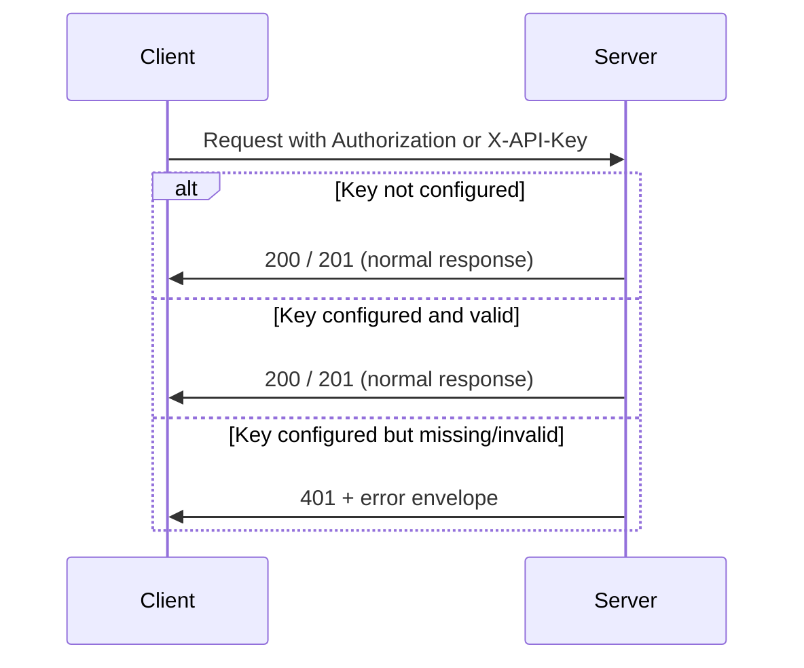

# Client-Side API Integration Guide

This document describes how to integrate a client (browser, mobile app, or Go service) with the Voxray HTTP and WebSocket API. It is based on the actual server implementation in this repository.

---

## 1. Overview

### Purpose

Single reference for integrating any client with the Voxray voice pipeline API: REST endpoints for health, readiness, WebRTC signaling, session creation, and the WebSocket transport for real-time voice.

### API target

- **Voxray server (voxray-go):** Voice pipeline (STT → LLM → TTS) over WebSocket or WebRTC. See [CONNECTIVITY.md](./CONNECTIVITY.md) for entry points and [pkg/server/server.go](../pkg/server/server.go) for route registration.

### Base URL and config

- There is **no client-side env var** defined in the repo for base URL. Clients must be configured with the server origin (e.g. `http://localhost:8080` or `https://your-server`).
- Server default: `host` (e.g. `0.0.0.0`) and `port` **8080** ([pkg/config/config.go](../pkg/config/config.go)). Use the same scheme and host/port the server listens on.

### Supported environments

- **Browsers:** HTTPS or `localhost` required for microphone access. CORS is applied when `cors_allowed_origins` (or `VOXRAY_CORS_ORIGINS`) is set.
- **Go:** Use `net/http` and optionally [pkg/transport/websocket](../pkg/transport/websocket) for `/ws`.
- **Any HTTP client:** All documented endpoints are standard HTTP/JSON (and WebSocket upgrade for `/ws`).

---

## 2. Setup & Configuration

### Dependencies

- **Browser/JS:** None for the existing clients; they use the native `fetch()` API.
- **Go:** Standard library `net/http`; for WebSocket use `voxray-go/pkg/transport/websocket` (see [pkg/transport/websocket/client.go](../pkg/transport/websocket/client.go)).

### Configuring the API client

- **Base URL:** Set the server origin (no trailing slash). Example: `http://localhost:8080`. The bundled HTML clients use an input field (e.g. `web/index.html`, `tests/frontend/webrtc-voice.html`); for your app you can use an env var such as `VOXRAY_BASE_URL` or a config file.
- **Auth:** If the server has `server_api_key` set (or `VOXRAY_SERVER_API_KEY`), send it on every protected request (see [Authentication Flow](#3-authentication-flow)).

### Initializing auth

No login or token exchange. If the server requires an API key, store it securely (e.g. env or secrets) and attach it to requests as described in the next section.

---

## 3. Authentication Flow

Voxray uses an **optional API key** only. There is no login, session token, or refresh flow.



### Attaching the token to requests

When `server_api_key` is set, the server checks `Authorization: Bearer <key>` or `X-API-Key: <key>` on:

- `POST /start` and `POST /api/v1/start`
- `POST` / `PATCH` `/sessions/:id/offer` (and legacy `/sessions/:id/api/offer`)
- `POST /webrtc/offer` and `POST /api/v1/webrtc/offer`
- WebSocket upgrade `GET /ws`

([requireAPIKey](https://github.com/voxray-go/blob/main/pkg/server/server.go) in `pkg/server/server.go`.)

**Browser (fetch):**

```javascript
const API_KEY = process.env.VOXRAY_SERVER_API_KEY || ''; // or from your config

const headers = {
  'Content-Type': 'application/json',
};
if (API_KEY) {
  headers['Authorization'] = `Bearer ${API_KEY}`;
  // or: headers['X-API-Key'] = API_KEY;
}

const resp = await fetch(`${baseUrl}/webrtc/offer`, {
  method: 'POST',
  headers,
  body: JSON.stringify({ offer: sdpString }),
});
```

**Go:**

```go
req, _ := http.NewRequestWithContext(ctx, http.MethodPost, baseURL+"/webrtc/offer", body)
req.Header.Set("Content-Type", "application/json")
if apiKey != "" {
    req.Header.Set("Authorization", "Bearer "+apiKey)
    // or: req.Header.Set("X-API-Key", apiKey)
}
resp, err := http.DefaultClient.Do(req)
```

### Logout

Not applicable; the key is stateless. “Logout” is simply to stop sending the key or to disconnect (e.g. close WebSocket / peer connection).

---

## 4. API Client Architecture

This repository does **not** provide a shared API client abstraction (no `apiClient.ts`, axios instance, or service layer).

- **Existing client code:**
  1. **HTML/JS:** Inline `fetch()` in [web/index.html](../web/index.html) and [tests/frontend/webrtc-voice.html](../tests/frontend/webrtc-voice.html) for `POST /webrtc/offer` (and OPTIONS). No shared module.
  2. **Go:** [pkg/transport/websocket/client.go](../pkg/transport/websocket/client.go) implements a WebSocket client for `ws://host/ws`. [sdk/go/voxray/client.go](../sdk/go/voxray/client.go) is a placeholder (empty struct).

> **Unabstracted call:** All current API usage is direct `fetch()` in the two HTML files. For new code, consider a small client module (e.g. `api.js` or a Go helper) that takes base URL and optional API key and performs requests so envelope handling and errors are consistent.

**Recommended minimal layout:**

- Single base URL + optional API key.
- One HTTP client (or fetch wrapper) that adds `Content-Type: application/json` and, when configured, `Authorization` or `X-API-Key`.
- Parse all success responses as envelope `{ data, meta }` and use `response.data` (see [Type Definitions](#10-type-definitions) and [Response envelope](#response-envelope-inconsistency)).

---

## 5. Service Modules / Endpoints

All success responses use the envelope `{ "data": ..., "meta": { "requestId": "..." } }`. Always read the payload from `body.data`. All errors use the [Error envelope](#error-envelope).

### Quick reference

| Endpoint | Method | Purpose | Success response |
|----------|--------|---------|-------------------|
| `/health`, `/api/v1/health` | GET | Liveness | `{ "data": { "status": "ok" }, "meta": {...} }` |
| `/ready`, `/api/v1/ready` | GET | Readiness | `{ "data": { "status": "ok" }, "meta": {...} }` |
| `/webrtc/offer`, `/api/v1/webrtc/offer` | POST, OPTIONS | WebRTC SDP offer → answer | `{ "data": { "answer": "<sdp>" }, "meta": {...} }` |
| `/start`, `/api/v1/start` | POST, OPTIONS | Create session (runner) | 201 `{ "data": { "sessionId", ... }, "meta": {...} }` |
| `/sessions/:id/offer` (legacy: `.../api/offer`) | POST, PATCH, OPTIONS | Session WebRTC offer | 200 `{ "data": { "answer", "type": "answer" }, "meta": {...} }` or 204 (PATCH) |
| `/ws` | GET (upgrade) | WebSocket transport | WebSocket (JSON or RTVI/protobuf by query) |

---

### Health — GET `/health` or `/api/v1/health`

- **Purpose:** Liveness probe.
- **Method:** GET only.
- **Request:** No body. No required headers (except auth if server API key is set, which is not typical for health).
- **Success:** 200, `{ "data": { "status": "ok" }, "meta": { "requestId": "..." } }`.
- **Errors:** 405 if method is not GET.

**Example (fetch):**

```javascript
const res = await fetch(`${baseUrl}/api/v1/health`);
const body = await res.json();
if (res.ok) console.log(body.data.status); // "ok"
```

---

### Ready — GET `/ready` or `/api/v1/ready`

- **Purpose:** Readiness; when the server uses Redis for session store, it pings Redis. Use for load balancer health checks.
- **Method:** GET only.
- **Request:** No body.
- **Success:** 200, `{ "data": { "status": "ok" }, "meta": {...} }`.
- **Errors:** 503 if Redis is unreachable (when Redis store is used), 405 for non-GET.

**Example (fetch):**

```javascript
const res = await fetch(`${baseUrl}/api/v1/ready`);
const body = await res.json();
if (!res.ok) throw new Error(body.error?.message || res.statusText);
```

---

### WebRTC offer — POST `/webrtc/offer` or `/api/v1/webrtc/offer`

- **Purpose:** Submit a WebRTC SDP offer and receive an SDP answer. Creates a new transport per request. Available when server `transport` is `smallwebrtc` or `both`.
- **Method:** POST (OPTIONS for CORS preflight).
- **Request body:** `{ "offer": "<sdp string>" }`. The offer is typically `JSON.stringify(rtcPeerConnection.localDescription)` (so a stringified SDP object).
- **Success:** 200, `{ "data": { "answer": "<sdp string>" }, "meta": { "requestId": "..." } }`. The answer may be a stringified SDP object; parse with `JSON.parse(body.data.answer)` if needed before `setRemoteDescription`.
- **Errors:** 400 (invalid JSON), 401 (missing/invalid API key), 405 (non-POST), 422 (missing or empty `offer`), 503 (e.g. Opus encoder unavailable), 500 (internal).

**Parameters:**

| Name | Type | Required | Description |
|------|------|----------|-------------|
| `offer` | string | Yes | SDP offer string (often stringified RTCSessionDescription). |

**Example (fetch):**

```javascript
const offerUrl = `${baseUrl}/api/v1/webrtc/offer`;
const resp = await fetch(offerUrl, {
  method: 'POST',
  headers: {
    'Content-Type': 'application/json',
    ...(apiKey && { 'Authorization': `Bearer ${apiKey}` }),
  },
  body: JSON.stringify({ offer: JSON.stringify(pc.localDescription) }),
});
if (!resp.ok) {
  const err = await resp.json();
  throw new Error(err.error?.message || resp.statusText);
}
const body = await resp.json();
const answerStr = body.data.answer;
const answer = typeof answerStr === 'string' ? JSON.parse(answerStr) : answerStr;
await pc.setRemoteDescription(new RTCSessionDescription(answer));
```

> **Response envelope inconsistency:** The server returns the envelope; the correct field for the answer is `body.data.answer`. The bundled HTML in [web/index.html](../web/index.html) and [tests/frontend/webrtc-voice.html](../tests/frontend/webrtc-voice.html) currently use `data.answer` (top-level), which is inconsistent with the API. Prefer `body.data.answer` for new code.

---

### Start session — POST `/start` or `/api/v1/start`

- **Purpose:** Create a runner session. Returns `sessionId` (and optionally `iceConfig`, or `dailyRoom`/`dailyToken` when `createDailyRoom` is true). Used before calling the session offer endpoint.
- **Method:** POST (OPTIONS for CORS).
- **Request body:** JSON with optional fields:
  - `createDailyRoom` (boolean): Create a Daily.co room and return room URL and token.
  - `enableDefaultIceServers` (boolean): Include default ICE servers in the response.
  - `body` (object): Arbitrary payload stored with the session and merged into request_data for the session offer.
- **Headers:** Optional `Idempotency-Key` (opaque string); same key returns cached 201 response.
- **Success:** 201, `{ "data": { "sessionId": "<uuid>", "iceConfig"?: { "iceServers": [...] }, "dailyRoom"?: "<url>", "dailyToken"?: "<token>" }, "meta": {...} }`.
- **Errors:** 400 (invalid JSON), 401 (missing/invalid API key), 405 (non-POST), 500 (e.g. store or Daily failure).

**Example (fetch):**

```javascript
const resp = await fetch(`${baseUrl}/api/v1/start`, {
  method: 'POST',
  headers: {
    'Content-Type': 'application/json',
    ...(apiKey && { 'Authorization': `Bearer ${apiKey}` }),
  },
  body: JSON.stringify({
    enableDefaultIceServers: true,
    body: { userId: 'user-1' },
  }),
});
if (!resp.ok) throw new Error((await resp.json()).error?.message);
const { data } = await resp.json();
const sessionId = data.sessionId;
const iceServers = data.iceConfig?.iceServers;
```

---

### Session offer — POST `/api/v1/sessions/:id/offer` (legacy: `/sessions/:id/api/offer`)

- **Purpose:** Submit a WebRTC SDP offer for an existing session; returns SDP answer. PATCH is used for ICE/trickle acknowledgment (204, no body).
- **Method:** POST (offer/answer), PATCH (trickle ack), OPTIONS.
- **Path:** `sessionId` must be a valid UUID. Prefer versioned path `/api/v1/sessions/:id/offer`; legacy `/sessions/:id/api/offer` is still supported.
- **Request body (POST):** `{ "sdp": "<sdp string>", "type"?: string, "pc_id"?: string, "restart_pc"?: boolean, "request_data"?: object, "requestData"?: object }`. `sdp` is required. `request_data` / `requestData` override session body for this request.
- **Success (POST):** 200, `{ "data": { "answer": "<sdp>", "type": "answer" }, "meta": {...} }`. **Success (PATCH):** 204, no body.
- **Errors:** 400 (invalid JSON or invalid session ID format), 401 (missing/invalid API key), 404 (session not found), 405 (wrong method), 422 (missing/empty SDP), 503/500 (transport/internal).

**Example (fetch):**

```javascript
const sessionId = '...'; // from POST /start
const offerUrl = `${baseUrl}/api/v1/sessions/${sessionId}/offer`;
const resp = await fetch(offerUrl, {
  method: 'POST',
  headers: {
    'Content-Type': 'application/json',
    ...(apiKey && { 'Authorization': `Bearer ${apiKey}` }),
  },
  body: JSON.stringify({ sdp: offerSdp }),
});
if (!resp.ok) throw new Error((await resp.json()).error?.message);
const { data } = await resp.json();
await pc.setRemoteDescription(new RTCSessionDescription({ type: data.type, sdp: data.answer }));
```

---

### WebSocket — GET `/ws`

- **Purpose:** Upgrade to WebSocket for the voice pipeline. One connection = one session. Frames are JSON (default), or RTVI/protobuf when requested via query (e.g. `?rtvi=1`, `?format=protobuf`). See [CONNECTIVITY.md](./CONNECTIVITY.md).
- **Method:** GET (WebSocket upgrade).
- **Request:** No body. Optional query: `rtvi=1`, `format=protobuf`.
- **Response:** WebSocket connection. If the server requires an API key, send it in the request headers (e.g. `Authorization: Bearer <key>`) on the upgrade request; otherwise 401.
- **Go client:** Use [pkg/transport/websocket/client.go](../pkg/transport/websocket/client.go): `NewClientTransport("ws://host/ws", nil)` then `Start(ctx)`; read/write frames via `Input()` and `Output()`.

**Example (browser):**

```javascript
const wsUrl = `${baseUrl.replace(/^http/, 'ws')}/ws`;
const ws = new WebSocket(wsUrl);
// If API key required, you may need to pass it in a query param or use a backend proxy that adds headers
```

---

## 6. Custom Hooks (React)

Not applicable. This repository does not contain a React frontend. There are no API-related React hooks.

---

## 7. State Management Integration

Not applicable. There is no React Query, Redux, or Zustand. The existing HTML clients keep state in the DOM and in local variables (e.g. `pc`, `localStream`, status text). For a React/SPA client, you would integrate the API (e.g. via a small fetch/axios module) with your chosen state layer and cache (e.g. React Query keys or Redux slices) as needed.

---

## 8. Error Handling Strategy

### Server behavior

All JSON error responses use the same envelope ([pkg/api/response.go](../pkg/api/response.go)):

```json
{
  "error": {
    "code": "VALIDATION_ERROR",
    "message": "Missing or empty offer",
    "requestId": "uuid",
    "details": [{ "field": "offer", "message": "required" }]
  }
}
```

**Error codes:** `UNAUTHORIZED`, `FORBIDDEN`, `VALIDATION_ERROR`, `NOT_FOUND`, `CONFLICT`, `RATE_LIMIT_EXCEEDED`, `INTERNAL_ERROR`, `BAD_REQUEST`, `UNPROCESSABLE_ENTITY`, `SERVICE_UNAVAILABLE`.

The server sends an `X-Request-ID` in responses (or echoes the request’s `X-Request-ID` when provided). Use it for support and logging.

### Client handling

- Check `resp.ok`. If false, parse JSON and read `body.error.code` and `body.error.message`; optionally `body.error.requestId` and `body.error.details`.
- There are no global interceptors in the repo. Recommended: a small wrapper that throws or returns a typed error (with code and requestId) so UI can show a consistent message.

**Example (fetch):**

```javascript
async function apiPost(path, body) {
  const res = await fetch(`${baseUrl}${path}`, {
    method: 'POST',
    headers: { 'Content-Type': 'application/json', ...authHeaders },
    body: JSON.stringify(body),
  });
  const data = await res.json();
  if (!res.ok) {
    const err = new Error(data.error?.message || res.statusText);
    err.code = data.error?.code;
    err.requestId = data.error?.requestId;
    throw err;
  }
  return data.data;
}
```

### User-facing display

No shared pattern in the repo. Suggested: show `error.message` and optionally “Request ID: …” for support.

---

## 9. Loading & Optimistic UI Patterns

In the existing clients:

- [tests/frontend/webrtc-voice.html](../tests/frontend/webrtc-voice.html) and [web/index.html](../web/index.html) disable the connect button and set status text (e.g. “connecting”, “Requesting microphone…”, “connected”) during the flow.
- There are no optimistic updates. The WebRTC flow is sequential: getUserMedia → createOffer → POST offer → setRemoteDescription → wait for tracks.

For new clients, use your usual loading pattern (spinner, disabled buttons, status text) and avoid optimistic updates until the server has returned the answer.

---

## 10. Type Definitions

Use these TypeScript/JSDoc shapes for request/response typing. They match the server ([pkg/api/response.go](../pkg/api/response.go) and [pkg/server/server.go](../pkg/server/server.go)).

### Success envelope

```typescript
interface SuccessEnvelope<T> {
  data: T;
  meta?: {
    requestId?: string;
  };
}
```

### Error envelope

```typescript
interface ErrorEnvelope {
  error: {
    code: string;
    message: string;
    requestId?: string;
    details?: Array<{ field: string; message: string }>;
  };
}

// Server error codes (literal union for strict typing)
type APIErrorCode =
  | 'UNAUTHORIZED'
  | 'FORBIDDEN'
  | 'VALIDATION_ERROR'
  | 'NOT_FOUND'
  | 'CONFLICT'
  | 'RATE_LIMIT_EXCEEDED'
  | 'INTERNAL_ERROR'
  | 'BAD_REQUEST'
  | 'UNPROCESSABLE_ENTITY'
  | 'SERVICE_UNAVAILABLE';
```

### Health / Ready

```typescript
type HealthData = { status: 'ok' };
// Response: SuccessEnvelope<HealthData>
```

### WebRTC offer

```typescript
interface WebRTCOfferRequest {
  offer: string;
}

interface WebRTCOfferData {
  answer: string;
}
// Response: SuccessEnvelope<WebRTCOfferData>
```

### Start session

```typescript
interface StartRequest {
  createDailyRoom?: boolean;
  enableDefaultIceServers?: boolean;
  body?: Record<string, unknown>;
}

interface StartData {
  sessionId: string;
  iceConfig?: {
    iceServers: Array<{ urls: string[] }>;
  };
  dailyRoom?: string;
  dailyToken?: string;
}
// Response: SuccessEnvelope<StartData>
```

### Session offer

```typescript
interface SessionOfferRequest {
  sdp: string;
  type?: string;
  pc_id?: string;
  restart_pc?: boolean;
  request_data?: Record<string, unknown>;
  requestData?: Record<string, unknown>;
}

interface SessionOfferData {
  answer: string;
  type: 'answer';
}
// Response: SuccessEnvelope<SessionOfferData>
```

---

## 11. Testing

### How the server is tested

- [pkg/server/http_metrics_test.go](../pkg/server/http_metrics_test.go) uses `httptest.NewRequest` and `httptest.NewRecorder` to exercise the metrics middleware with a GET to `/health`.
- [tests/pkg/server/server_test.go](../tests/pkg/server/server_test.go) only ensures the server package builds.
- [tests/stress_testing/http_stress_test.go](../tests/stress_testing/http_stress_test.go) starts a **mock** HTTP server with `POST /test/webrtc/offer` that returns `{ "answer": "mock" }` (no envelope). That mock is for load testing the pipeline, not for documenting the real API shape.

### Mocking the API in your tests

For unit or integration tests that call the Voxray API, run a mock server that returns the **real envelope** so your client code (e.g. `body.data.answer`) is tested correctly.

**Go (httptest):**

```go
mux := http.NewServeMux()
mux.HandleFunc("/api/v1/webrtc/offer", func(w http.ResponseWriter, r *http.Request) {
    if r.Method != http.MethodPost {
        http.Error(w, "method not allowed", http.StatusMethodNotAllowed)
        return
    }
    w.Header().Set("Content-Type", "application/json")
    w.WriteHeader(http.StatusOK)
    json.NewEncoder(w).Encode(map[string]interface{}{
        "data":  map[string]string{"answer": `{"type":"answer","sdp":"mock-sdp"}`},
        "meta":  map[string]string{"requestId": "test-id"},
    })
})
srv := httptest.NewServer(mux)
defer srv.Close()
// Use srv.URL as baseUrl in your client
```

**Node (fetch mock / MSW):**

Return the envelope so code that reads `body.data.answer` is correct:

```javascript
// Example: mock response body
const mockOfferResponse = {
  data: { answer: JSON.stringify({ type: 'answer', sdp: 'v=0\r\n...' }) },
  meta: { requestId: 'test-request-id' },
};
```

### E2E / integration

The repo has an e2e test that POSTs to a real server at `http://localhost:18080/webrtc/offer` ([tests/pkg/pipeline/webrtc_sarvam_groq_voice_e2e_test.go](../tests/pkg/pipeline/webrtc_sarvam_groq_voice_e2e_test.go)). It decodes the response into a struct with only `Answer` (top-level). That expects the **unwrapped** shape; the real server returns the envelope, so that test may rely on a different build or should be updated to use `body.data.answer` for consistency with the API.

---

## Deprecated / legacy

- **Session offer path:** Prefer `/api/v1/sessions/:id/offer`. The path `/sessions/:id/api/offer` is still supported but considered legacy.

---

## References

- [CONNECTIVITY.md](./CONNECTIVITY.md) — What can connect (WebSocket, WebRTC, telephony, Daily).
- [pkg/server/server.go](../pkg/server/server.go) — Route registration and handlers.
- [pkg/api/response.go](../pkg/api/response.go) — Success and error envelope types and codes.
