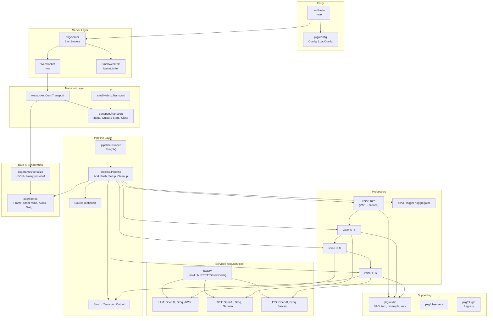
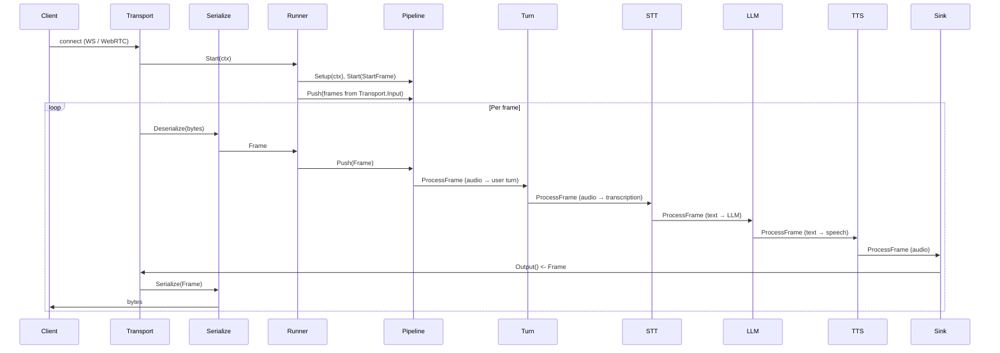

# Voila-Go Architecture

High-level architecture of the **voila-go** real-time voice pipeline server.

---

## 1. System Overview

```
┌─────────────────────────────────────────────────────────────────────────────────┐
│                              CLI (cmd/voila)                                      │
│  Load config → Register processors → Start servers → On new transport: build      │
│  pipeline + runner, run in goroutine                                              │
└─────────────────────────────────────────────────────────────────────────────────┘
                                          │
                                          ▼
┌─────────────────────────────────────────────────────────────────────────────────┐
│                           SERVER (pkg/server)                                     │
│  HTTP server: /ws (WebSocket), /webrtc/offer (SmallWebRTC).                      │
│  For each new connection → callback onTransport(transport)                         │
└─────────────────────────────────────────────────────────────────────────────────┘
                                          │
                                          ▼
┌─────────────────────────────────────────────────────────────────────────────────┐
│                        TRANSPORT (pkg/transport)                                  │
│  Interface: Input() ←chan Frame, Output() chan← Frame, Start(), Close()           │
│  Implementations: WebSocket (pkg/transport/websocket), SmallWebRTC               │
└─────────────────────────────────────────────────────────────────────────────────┘
                                          │
                                          ▼
┌─────────────────────────────────────────────────────────────────────────────────┐
│                        RUNNER (pkg/pipeline)                                      │
│  Wires Transport ↔ Pipeline. Transport.Input → Pipeline.Push; pipeline output   │
│  → Transport.Output. Setup/Cleanup pipeline, push StartFrame, block on ctx.      │
└─────────────────────────────────────────────────────────────────────────────────┘
                                          │
                                          ▼
┌─────────────────────────────────────────────────────────────────────────────────┐
│                        PIPELINE (pkg/pipeline)                                    │
│  Linear chain of Processors. Push(frame) → first processor → … → last (Sink).     │
│  Source (optional) reads from channel; Sink writes to Transport.Output.          │
└─────────────────────────────────────────────────────────────────────────────────┘
                                          │
                                          ▼
┌─────────────────────────────────────────────────────────────────────────────────┐
│                     PROCESSORS (pkg/processors)                                    │
│  Turn (VAD + silence) → STT → LLM → TTS → Sink   (voice pipeline)                 │
│  Or: plugins (echo, logger, aggregator, dtmf_aggregator, llmtext, …) → Sink        │
└─────────────────────────────────────────────────────────────────────────────────┘
```

---

## 2. Component Diagram (Mermaid)



---

## 3. Data Flow (Frames)



---

## 4. Layer Summary

| Layer | Package(s) | Responsibility |
|-------|------------|----------------|
| **Entry** | `cmd/voila` | Load config, register processors, start server, build pipeline per transport |
| **Server** | `pkg/server` | HTTP server; WebSocket `/ws` and/or SmallWebRTC `/webrtc/offer`; runner-style `/start`, `/sessions/{id}/api/offer`; telephony POST `/` + `/telephony/ws`; Daily GET `/`, `/daily-dialin-webhook`; `onTransport` callback; `pkg/runner` SessionStore for runner sessions |
| **Transport** | `pkg/transport`, `transport/websocket`, `transport/smallwebrtc`, `transport/memory`, `transport/whatsapp`; telephony via websocket + provider serializers | Bidirectional frame channels (Input/Output), Start/Close |
| **Runner** | `pkg/pipeline` (Runner) | Connect transport to pipeline; forward input → Push; pipeline output → transport |
| **Pipeline** | `pkg/pipeline` (Pipeline) | Linear processor chain; Setup/Cleanup; Push(StartFrame), Push(frames) |
| **Processors** | `pkg/processors`, `processors/voice`, `processors/echo`, `processors/aggregators/*` | Turn (VAD), STT, LLM, TTS, Sink; echo/logger/aggregator; aggregators (dtmf_aggregator, gated, llmfullresponse, llmtext, userresponse, gated_llm_context, llmcontextsummarizer) |
| **Services** | `pkg/services`, `services/*` | LLM, STT, TTS provider implementations (OpenAI, Groq, Sarvam, AWS, …) |
| **Frames** | `pkg/frames`, `frames/serialize` | Frame types (Start, Cancel, Audio, Text, Transcription, …); JSON / binary protobuf |
| **Support** | `pkg/config`, `pkg/audio`, `pkg/observers`, `pkg/plugin` | Config, VAD/turn/resample, metrics, plugin registry |

---

### 4.1 Wire format compatibility

Binary **Frame** wire format (Text, Audio, Transcription, Message) follows a common frame proto: same message names, field numbers, and types. Use `ProtobufSerializer` on WebSocket binary messages for interoperability with external clients or servers.

**Voila-go–specific:** JSON envelope (type + data) and system frames (StartFrame, CancelFrame, ErrorFrame) are not in the shared proto; they are used for JSON transport or skipped when using binary protobuf.

---

## 5. Voice Pipeline (Simplified)

When `config` has `provider` and `model`, the server builds a **voice pipeline**:

1. **Turn** (optional): VAD + silence-based turn detection → emits user speech segments.
2. **STT**: Audio → transcription frames (via configured STT provider).
3. **LLM**: Transcript + context → LLM text frames (via configured LLM provider).
4. **TTS**: Text → audio frames (via configured TTS provider).
5. **Sink**: All frames → `Transport.Output()` (back to client).

Otherwise, the pipeline is built from **config.Plugins** (e.g. echo, logger, aggregator) and ends with Sink.

**Aggregators** (in `pkg/processors/aggregators/`) can be registered and used in plugin pipelines or composed with the voice pipeline:

- **dtmf_aggregator**: Accumulates `InputDTMFFrame` digits; flushes as `TranscriptionFrame` on timeout, `#`, or End/Cancel. Place before LLM when using DTMF input (e.g. telephony IVR).
- **gated**: Buffers frames when a custom gate is closed; releases when gate opens. Use for flow control.
- **llmfullresponse**: Aggregates LLM text between `LLMFullResponseStartFrame` and `LLMFullResponseEndFrame`; calls an optional callback on completion or interruption (e.g. for voicemail/IVR).
- **llmtext**: Converts `LLMTextFrame` → `AggregatedTextFrame` via a configurable text aggregator (e.g. sentence). Place after LLM, before TTS or sentence aggregator.
- **userresponse**: Buffers `TranscriptionFrame` and emits one aggregated transcription on `UserStoppedSpeakingFrame` or End/Cancel. Use when the pipeline provides user-turn boundaries.
- **gated_llm_context**: Holds `LLMContextFrame` until a notifier signals release.
- **llmcontextsummarizer**: Monitors context size; pushes `LLMContextSummaryRequestFrame` when thresholds are exceeded; applies `LLMContextSummaryResultFrame` to compress history.

**Frameworks** (`pkg/processors/frameworks/`) integrate external runtimes and the RTVI protocol (ported from upstream frameworks):

- **external_chain**: Calls an HTTP endpoint (e.g. Langchain or Strands sidecar) with the last user message from `LLMContextFrame` and streams the response as `LLMTextFrame`. Configure via `plugin_options["external_chain"]` with `url`, `stream`, `timeout_sec`, `transcript_key`.
- **rtvi**: RTVI (Real-Time Voice Interface) protocol processor. Handles client-ready, send-text (injects `TranscriptionFrame`), and pushes bot-ready/error as RTVI server messages. Use WebSocket with `?rtvi=1` and include `rtvi` in plugins; see [FRAMEWORKS.md](./FRAMEWORKS.md).

---

### 5.1 Runner modes and entry points

- **WebSocket / WebRTC:** `transport` = `websocket`, `smallwebrtc`, or `both`. Clients use `/ws` or `POST /webrtc/offer`.
- **Runner:** When WebRTC or Daily is enabled, `POST /start` creates a session (optionally with `createDailyRoom`); clients then send `POST` or `PATCH` to `/sessions/{sessionId}/api/offer` with SDP. SessionStore holds session body and ICE options per sessionId.
- **Telephony:** `runner_transport` = `twilio`, `telnyx`, `plivo`, or `exotel`. Provider calls `POST /` (XML webhook); media flows over `/telephony/ws` (WebSocket with provider-specific frame serialization).
- **Daily:** `runner_transport=daily`. `GET /` creates a room and redirects to it; optional `POST /daily-dialin-webhook` for PSTN dial-in. Room clients use the same pipeline via WebRTC.

See [SYSTEM_ARCHITECTURE.md](./SYSTEM_ARCHITECTURE.md) for the full system view and entry-point table.

---

## 6. File Layout (Key Paths)

```
voila-go/
├── cmd/voila/           # Entry: main, init
├── pkg/
│   ├── server/          # StartServers; /ws, /webrtc/offer, /start, /sessions, telephony, Daily routes
│   ├── transport/       # Transport interface; websocket (server + client), smallwebrtc, memory, whatsapp; base
│   ├── pipeline/        # Pipeline, Runner, Source, Sink, Registry
│   ├── processors/      # Processor interface; voice (Turn, STT, LLM, TTS), echo, aggregator, logger; aggregators; filters; frameworks (external_chain, rtvi)
│   ├── services/        # Factory; LLM/STT/TTS providers; RealtimeService (use realtime.NewFromConfig)
│   ├── realtime/        # OpenAI Realtime API (RealtimeSession, RealtimeService)
│   ├── runner/          # SessionStore; daily (room/token); telephony message parsing, serializers
│   ├── frames/          # Frame types; serialize (JSON, binary protobuf; twilio, telnyx, plivo, exotel, …)
│   ├── config/          # Config, LoadConfig
│   ├── audio/           # VAD, turn, resample, wav
│   ├── observers/       # ObservingProcessor, metrics, turn tracking, user-bot latency
│   ├── plugin/          # Plugin interface, Registry
│   └── extensions/      # voicemail, ivr
├── config.json
└── docs/
    ├── ARCHITECTURE.md       # This file
    └── SYSTEM_ARCHITECTURE.md
```

This document and the Mermaid diagrams can be viewed in any Markdown viewer that supports Mermaid (e.g. GitHub, VS Code with Mermaid extension).
