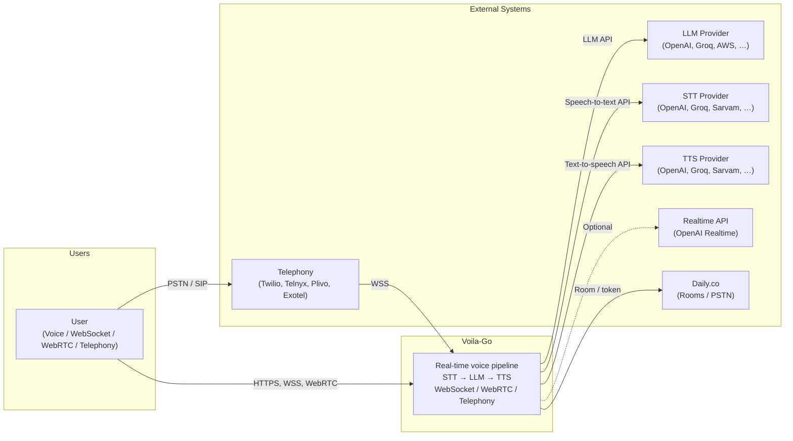
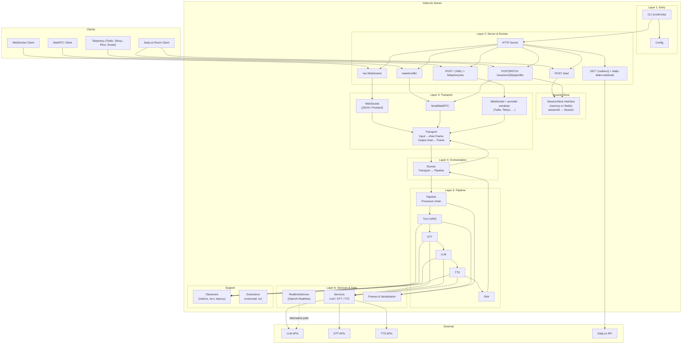
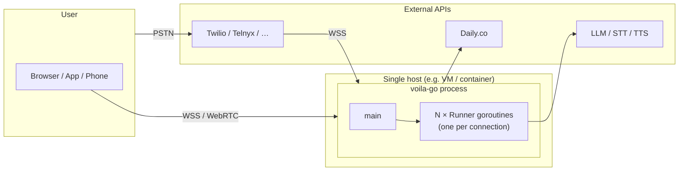

# Voila-Go System Architecture

System-level view of the **voila-go** real-time voice pipeline. For component details, data flow, and file layout see [ARCHITECTURE.md](./ARCHITECTURE.md).

---

## 1. System Context (C4 Level 1)



**In words:** Users connect to Voila-Go via WebSocket, WebRTC, or telephony (Twilio, Telnyx, Plivo, Exotel). Voila-Go runs a configurable pipeline (e.g. voice: VAD → STT → LLM → TTS) and talks to external LLM, STT, and TTS providers. An optional **Realtime** path (e.g. OpenAI Realtime API) can replace the STT+LLM+TTS chain. Frames (audio, text, transcriptions) flow bidirectionally between client and server. Daily.co provides rooms and optional PSTN dial-in; telephony providers use WebSocket backhaul to the server.

---

## 2. Layered System Architecture



| Layer | Responsibility |
|-------|----------------|
| **1 Entry** | Load config, register processors, start server; on new transport → build pipeline + runner |
| **2 Server & Runner** | HTTP server; WebSocket `/ws`; SmallWebRTC `/webrtc/offer`; Pipecat-style `/start`, `/sessions/{id}/api/offer`; telephony POST `/` (XML) + `/telephony/ws`; Daily GET `/` (redirect) and `/daily-dialin-webhook`. Session store for runner sessions. |
| **3 Transport** | Bidirectional frame streams (Input/Output), Start/Close; WebSocket, SmallWebRTC, telephony WebSocket (provider-specific serializers), memory (tests). |
| **4 Orchestration** | Runner wires Transport ↔ Pipeline; forwards input → Push, pipeline output → transport |
| **5 Pipeline** | Linear processor chain (Turn → STT → LLM → TTS → Sink or plugins → Sink) |
| **6 Services & Data** | LLM/STT/TTS providers; optional RealtimeService (OpenAI Realtime); Frame types and JSON/protobuf serialization |
| **Support** | Observers (metrics, turn tracking, user–bot latency); extensions (voicemail, ivr) |

---

## 3. Entry Points and Runner Modes

| Mode | Config | Entry points | Transport source |
|------|--------|--------------|------------------|
| **WebSocket only** | `transport=websocket` (or `""`) | `GET /ws` | `pkg/transport/websocket` |
| **WebRTC only** | `transport=smallwebrtc` | `POST /webrtc/offer` | `pkg/transport/smallwebrtc` |
| **Both** | `transport=both` | `/ws`, `POST /webrtc/offer` | Same as above |
| **Runner (Pipecat-style)** | `transport=both` or WebRTC, or `runner_transport=daily` | `POST /start`, `POST|PATCH /sessions/{id}/api/offer` | SessionStore + SmallWebRTC |
| **Daily** | `runner_transport=daily` | `GET /` → redirect to room; optional `POST /daily-dialin-webhook` | Daily.co API + room client → /sessions |
| **Telephony** | `runner_transport=twilio|telnyx|plivo|exotel` | `POST /` (XML webhook), `GET /telephony/ws` | WebSocket with provider serializer |

---

## 4. Runtime: One Connection

```mermaid
sequenceDiagram
    autonumber
    participant Client
    participant Server
    participant Transport
    participant Runner
    participant Pipeline
    participant Processors

    Client->>Server: Connect (WS / WebRTC / Telephony WS)
    Server->>Transport: New transport
    Server->>Runner: Run(transport) [goroutine]
    Runner->>Pipeline: Setup(ctx), Push(StartFrame)

    loop Frames
        Client->>Transport: bytes
        Transport->>Runner: Frame (Input)
        Runner->>Pipeline: Push(Frame)
        Pipeline->>Processors: Turn → STT → LLM → TTS → Sink
        Processors->>Pipeline: output frames
        Pipeline->>Runner: frames to Sink
        Runner->>Transport: Output() ← Frame
        Transport->>Client: bytes
    end

    Note over Client,Processors: One goroutine per connection; pipeline is linear.
```

---

## 5. Deployment View



- **Single process:** One `voila-go` process; one goroutine per active connection (Runner).
- **Scaling:** **Vertical** — run one instance; use default in-memory SessionStore. **Horizontal** — run multiple instances behind a load balancer; set `session_store=redis` and `redis_url` so all instances share session state via Redis (Redis is then an external dependency).
- **Config:** `config.json` (and env) drives providers, pipeline shape, `transport`, `runner_transport`, and optional `session_store` / `redis_url` / `session_ttl_secs` for shared sessions.

---

## 6. Key Design Decisions

| Decision | Rationale |
|----------|-----------|
| **Transport interface** | Same pipeline runs over WebSocket or WebRTC or telephony WebSocket; easy to add more transports. |
| **Linear processor chain** | Simple Push(frame) flow; each processor does one job (Turn, STT, LLM, TTS, Sink). |
| **Runner per connection** | Isolates sessions; one connection failure does not block others. |
| **Frames + serialization** | Unified Frame type (audio, text, transcription, …); JSON or binary protobuf for pipecat compatibility; provider-specific serializers for telephony. |
| **Config-driven pipeline** | Voice pipeline (provider + model) or plugin chain (echo, logger, aggregator, …) from config. |
| **Session store** | SessionStore interface: in-memory (default, single instance) or Redis (shared across instances for horizontal scaling). Used by Pipecat-style /start and /sessions; sessionId → Session (body, ICE options). Config: `session_store`, `redis_url`, `session_ttl_secs`. |
| **Realtime service** | Optional RealtimeService (e.g. OpenAI Realtime API) for single-WebSocket voice; lives alongside LLM/STT/TTS in services. |
| **Observers** | Metrics, turn tracking, and user–bot latency wrapped around processors for observability. |

---

## 7. References

- **Full architecture:** [ARCHITECTURE.md](./ARCHITECTURE.md) — components, Mermaid diagrams, data flow, file layout.
- **Deployment:** [DEPLOYMENT.md](./DEPLOYMENT.md) — production deployment, env vars, health, TLS, scaling, security.
- **Extensions:** [EXTENSIONS.md](./EXTENSIONS.md) — adding processors and transports.
- **API:** [swagger.yaml](./swagger.yaml) / [swagger.json](./swagger.json).
