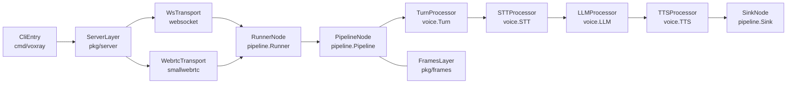

## 5. Key Concepts a Contributor Must Understand

This section focuses on **mental models and non‑obvious patterns** in Voxray. It assumes you’ve skimmed the architecture docs and now need to understand *how to think* about the system when making changes.

---

### 5.1 Layered Architecture & Flow

At a high level, Voxray is **layered**:

- **CLI / Entry (`cmd/voxray`)**
  - Loads `config.json`, applies env overrides, configures logging.
  - Registers built‑in processors in the plugin registry.
  - Creates global infra (recording uploader, transcript store).
  - Starts servers via `server.StartServers`, passing an `onTransport` callback that builds a pipeline and `Runner` for each connection.

- **Server layer (`pkg/server`)**
  - Exposes HTTP endpoints (`/ws`, `/webrtc/offer`, `/start`, `/sessions/{id}/api/offer`, `/telephony/ws`, `/health`, `/ready`, `/metrics`, Daily routes).
  - Handles CORS, API key auth, and metrics middleware.
  - For WebSocket endpoints, instantiates a `ws.Server` that wraps WebSocket connections into transports.

- **Transport layer (`pkg/transport` and subpackages)**
  - Defines the `Transport` interface (`Input`, `Output`, `Start`, `Close`).
  - Implementations:
    - WebSocket (`transport/websocket`).
    - SmallWebRTC (`transport/smallwebrtc`).
    - Telephony (WebSocket plus provider‑specific frame serializers).
    - Memory transports for tests.

- **Runner (`pkg/pipeline/runner.go`)**
  - Bridges `Transport` and `Pipeline`:
    - Starts the transport, pushes a `StartFrame`, and then forwards incoming frames via a buffered queue into `Pipeline.Push`.
    - Lets processors emit frames to `Transport.Output` via the sink.
  - One `Runner` goroutine per connection; cancellation via `context.Context`.

- **Pipeline & processors (`pkg/pipeline`, `pkg/processors/**`)**
  - A `Pipeline` is a linear chain of `Processor`s; each processor sees a sequence of `Frame`s and can emit more frames downstream or upstream.
  - Voice pipeline is a specific arrangement: Turn (VAD) → STT → LLM → TTS → Sink.

- **Frames & serialization (`pkg/frames`, `pkg/frames/serialize/**`)**
  - Frames are strongly‑typed in Go (structs implementing `FrameType()`).
  - Serializers turn frames into JSON envelopes or protobuf messages depending on transport and query params.

#### 5.1.1 Runtime flow (Mermaid)

**Skill implication**: Always ask “which layer should this change live in?” (server, transport, pipeline, or processor) and how it impacts upstream/downstream flows and frames.

---

### 5.2 Frames as the Core DSL

Frames are Voxray’s **internal language** for everything: audio, text, control, context, tools, and extensions.

- **Data frames vs control frames**
  - Data: `AudioRawFrame`, `TranscriptionFrame`, `LLMTextFrame`, `TTSAudioRawFrame`, `AggregatedTextFrame`.
  - Control: `StartFrame`, `CancelFrame`, `ErrorFrame`, `UserStoppedSpeakingFrame`, `VADParamsUpdateFrame`, various LLM context and tool frames.
  - Design intent: processors don’t know transports or providers; they just react to frames.

- **LLM context & tools (`pkg/frames/llm.go`)**
  - `LLMContextFrame` holds:
    - `Messages`: conversation history (OpenAI‑style structures).
    - `Tools`: tool/function schemas for function‑calling.
    - `ToolChoice`: `"none"`, `"auto"`, `"required"`, or a provider‑specific JSON object.
  - `LLMMessagesUpdateFrame` and `LLMMessagesAppendFrame` let processors rewrite or extend context.
  - `FunctionCallResultFrame` returns tool results to the LLM.
  - `LLMFullResponseStartFrame` / `LLMFullResponseEndFrame` bracket complete LLM responses for aggregation.

- **Domain‑specific frames (voice, IVR, voicemail)**
  - Turn/VAD: `VADParamsUpdateFrame`, turn analysis frames, and `UserStoppedSpeakingFrame`.
  - Telephony: DTMF frames (`InputDTMFFrame`, `OutputDTMFUrgentFrame`) and codecs handled by serializers.
  - Extensions: use frames to switch modes (conversation vs IVR), update VAD settings, or gate TTS until classification completes.

**Skill implication**: To add new behavior, you usually **invent or reuse a frame** and teach processors and serializers how to react, instead of wiring new side channels or flags.

---

### 5.3 Processors, Observers & Pipelines

- **Processor pattern (`pkg/processors`)**
  - Each processor implements a `ProcessFrame(ctx, frame, direction)` method and exposes `Next()` / `Prev()` for chaining.
  - `Direction` can be downstream or upstream:
    - Downstream: client → pipeline → transport response.
    - Upstream: extension or aggregator sending frames back toward earlier processors (e.g. IVR sending `LLMMessagesUpdateFrame` upstream to LLM).
  - Processors should be:
    - **Stateless or minimally stateful** where possible.
    - Careful about long‑running operations; heavy work should be offloaded or bounded.

- **Pipeline composition (`pkg/pipeline`)**
  - Core API: `Add`, `Push`, `Start`, `Setup`, `Cleanup`, and `AddFromConfig` (plugin registry).
  - Supports nested/parallel pipelines via the `PipelineProcessor` pattern, used by voicemail detector and frameworks.
  - Voice pipeline is composed directly in `cmd/voxray/main.go`; plugin pipelines use names from `cfg.Plugins`.

- **Observers (`pkg/observers`)**
  - Wrap processors to add **cross‑cutting behavior**:
    - Metrics: latency, error counts, streaming lag.
    - Turn tracking and user‑bot latency measurement.
    - Transcript logging (`TranscriptObserver`) using per‑session `Store`.
  - Implement `Observer` interfaces and are attached via `observers.WrapWithObserver`.

**Skill implication**: When you need telemetry or side effects, **prefer observers** (or aggregators) over adding logic directly inside core processors, to keep responsibilities clean.

---

### 5.4 Extensions & Framework Integrations

- **IVR extension (`pkg/extensions/ivr`, `docs/EXTENSIONS.md`)**
  - Uses an LLM classifier and `IVRProcessor` to:
    - Decide if the current audio is an IVR menu vs human conversation.
    - Emit DTMF keystrokes for menu navigation.
    - Switch VAD parameters (shorter stop seconds) for IVR.
  - Relies heavily on:
    - Pattern aggregation of LLM output (text tags like `` ` 1 ` ``).
    - Upstream `LLMMessagesUpdateFrame` and `VADParamsUpdateFrame` to reconfigure upstream processors.

- **Voicemail extension (`pkg/extensions/voicemail`, `docs/EXTENSIONS.md`)**
  - Builds a parallel pipeline branch to **classify calls as CONVERSATION vs VOICEMAIL**.
  - Uses gates to:
    - Delay TTS output until classification finishes.
    - Discard TTS if the call is voicemail and emit a custom prompt instead.

- **Framework processors (`pkg/processors/frameworks/*`, `docs/FRAMEWORKS.md`)**
  - `external_chain`: hands LLM work to an HTTP sidecar (LangChain, Strands).
  - `rtvi`: speaks the RTVI protocol over WebSocket, mapping between RTVI messages and frames.

**Skill implication**: These extensions demonstrate how to:
  - Build **mode‑switching behaviors** (conversation vs IVR vs voicemail) using context updates and gates.
  - Integrate external runtimes while still honoring the core frame and processor architecture.

---

### 5.5 Tools & MCP

- **MCP client (`pkg/mcp`)**
  - Connects to a Model Context Protocol server via stdio, lists tools, and converts their schemas into internal `FunctionSchema` structures.
  - Registers tools on `LLMServiceWithTools` implementations (e.g. OpenAI), wiring handlers that:
    - Serialize arguments to `CallTool`.
    - Post‑process results (optional output filters).
    - Return string results to the LLM.

- **Tool‑calling LLM pattern**
  - LLM sees tools in its context (`Tools` on `LLMContext`), emits tool calls; the LLM adapter streams tokens and tool calls as frames.
  - Tool results are passed back via `FunctionCallResultFrame`, allowing recursive use of tools.

**Skill implication**: Extending tools requires understanding both:
  - How schemas are represented (JSON Schema‑like objects).
  - How streaming LLMs interleave tokens and tool calls.

---

### 5.6 Domain‑Specific Patterns & Conventions

- **Turn‑based voice UX**
  - VAD parameters and `TurnProcessor` control when “user is speaking” vs “user stopped speaking”.
  - Many downstream processors (STT, LLM) assume meaningful **user turns** rather than raw audio; misconfigured VAD leads to partial phrases or long latency.

- **Eventual consistency**
  - **Recordings**: Session audio is uploaded to S3 asynchronously; success/failure appears in metrics and logs, not in the client flow.
  - **Transcripts**: Transcript DB inserts are best‑effort; failures should be visible in logs and metrics but must not break voice flows.

- **Configuration conventions**
  - Options are always added to `config.Config` with JSON tags and env overrides where appropriate.
  - New features should:
    - Have safe defaults.
    - Be opt‑in (especially for experimental providers or integrations).
    - Be documented in `README.md` or a relevant `docs/*.md`.

**Skill implication**: Contributors must internalize that Voxray prioritizes **real‑time voice correctness and latency** over secondary concerns; infra features like recordings or transcripts should degrade gracefully without breaking calls.

---

### 5.7 Onboarding Guidance (Key Concepts)

- **Complexity rating: High**
  - Understanding these concepts requires synthesizing information across **multiple packages and docs** (architecture, frames, processors, services, observers, extensions).
  - A mid‑level engineer should expect to spend **several days** reading and experimenting (e.g. adding a simple processor or extension) to feel confident making architectural changes, especially around frames, pipelines, or extensions. 

